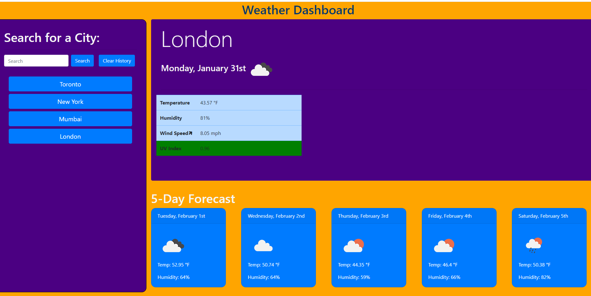

# Introduction:

Weather Dashboard are a tool that help plan our personal lives around upcoming weather forecasts.
The goal of predicting weather forecasts is to provide weather information people and organizations can use to reduce weather-related losses and enhance societal benefits, including protection of life and property, public health and safety, and support of economic prosperity and quality of life.

# Purpose of this project:

As a frequent traveller, I wantto see the weather outlook for multiple cities so that I can plan a trip accordingly.

# Technologies Used:
HTML => for base skeleton for webpage
CSS => formatting the design
Bootstrap => for preset HTML designs
Javascript => for logic and controlling behaviour of the webpage 
Moment.js => for times and date formatting
Ajax => for calling on server to retrieve data from another application's API.
OpenWeatherMAP => Free Weather App that has all the data.

# Lessons Learned:

1. Commenting on the Javascript codes  helped extremely in keeping the overall code organized.
2. Third-party APIs allow developers to access their data and functionality by making specific requests to a URL. 
    This user specific URL can be attained by signing up. Refer to the API's documentation for proper retrieval of their data.
3. Order of scripts and code does matter!

# Screenshot:

# Launch:

31 January 2022

Please see the link for Deployed Project: